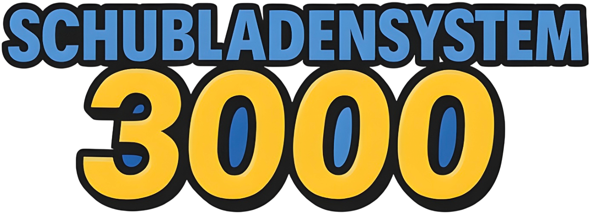
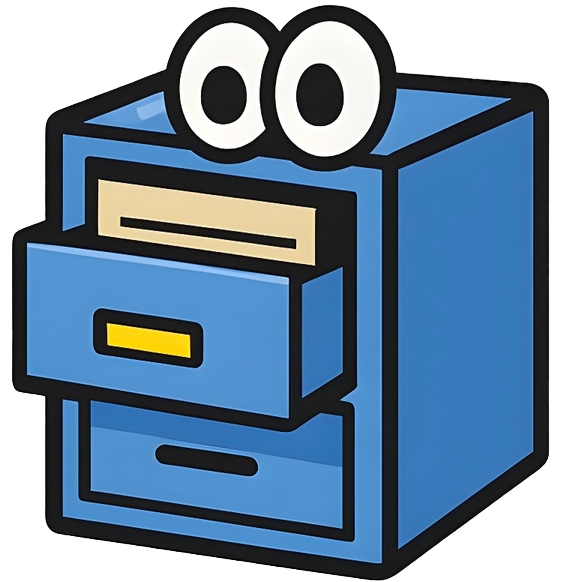

<p align="center">
  
</p>

<p align="center">
  
  
  
  
</p>

<div align="center">
  <h3>
    <strong>A Windows Forms GUI application written in PowerShell that automatically sorts desktop files into structured subfolders based on file type. Developed as a learning project for the LB122 module.</strong>
  </h3>
  <h4>
    <em>Automatic • GUI-based • File Organization</em>
  </h4>
</div>

<p align="center">
  <a href="#-overview"><b>🖼️ Overview</b></a> •
  <a href="#-features"><b>⚙️ Features</b></a> •
  <a href="#-usage"><b>▶️ Usage</b></a> •
  <a href="#-installation"><b>📦 Installation</b></a>
</p>

<hr>



## 🖼️ Overview

This tool provides a simple graphical user interface (GUI) to clean up file clutter from the Windows desktop. It detects various file types and automatically moves them into appropriate subfolders within a main folder (`Test-Ordner`) located on the desktop.

> 💡 The script only sorts **files**, not folders.

<hr>

## ✨ Features

<table>
  <tr>
    <td width="200"><h3 align="center">✅</h3><h3 align="center"><b>Status Display</b></h3></td>
    <td>Shows current desktop files, target path, and folder status</td>
  </tr>
  <tr>
    <td width="200"><h3 align="center">📁</h3><h3 align="center"><b>Folder Creation</b></h3></td>
    <td>Automatically creates main and subfolders</td>
  </tr>
  <tr>
    <td width="200"><h3 align="center">🔄</h3><h3 align="center"><b>File Sorting</b></h3></td>
    <td>Moves desktop files to the appropriate folders</td>
  </tr>
  <tr>
    <td width="200"><h3 align="center">📜</h3><h3 align="center"><b>Log Window</b></h3></td>
    <td>Displays all actions and errors in real time</td>
  </tr>
  <tr>
    <td width="200"><h3 align="center">🖱️</h3><h3 align="center"><b>GUI Buttons</b></h3></td>
    <td>Interactive control via buttons (Update Status, Sort Files, Exit)</td>
  </tr>
</table>

<hr>

## 📁 Supported File Types and Folders

| Folder        | Extensions                                      |
|---------------|-------------------------------------------------|
| Assembler     | `.asm`, `.s`                                    |
| Databases     | `.sql`                                          |
| Scripts       | `.py`, `.js`, `.ts`, `.rb`, `.sh`, `.ps1`, `.bat`, `.pl` |
| Texts         | `.txt`, `.md`, `.rtf`                           |
| Websites      | `.html`, `.css`                                 |

<hr>

## ▶️ Usage

1. **Start the script**: Right-click → "Run with PowerShell"  
2. The GUI will open automatically.
3. Choose one of the available actions:
   - `Update Status`: Shows current number of files and folder structure.
   - `Create Folders`: Creates the necessary folder structure.
   - `Sort Files`: Moves all recognized files.
   - `Exit`: Closes the program.

<hr>

## 📦 Installation

### Download & Setup

1. Open PowerShell on Windows.
2. Make sure script execution is allowed (run as admin if needed):
```powershell
Set-ExecutionPolicy RemoteSigned
```
3. Download the script (script.ps1) and run it:
```powershell
.\sortierer.ps1
```

<hr>

## 🧠 Technical Details

- Developed using PowerShell and Windows Forms (System.Windows.Forms)
- Uses Add-Type to access GUI components
- All actions are fully controllable through the GUI
- Log entries include timestamps for easy tracking

<hr>

<div align="center">
  <p><i>© 2025 LB122 Learning Project</i></p>
</div>
